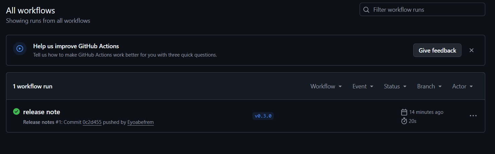
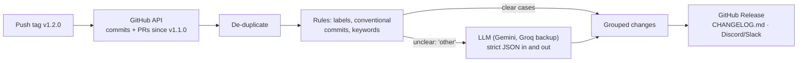

# Patchnote

**AI-written release notes, published when you push a version tag.**

Push `v1.2.0` and Patchnote reads everything merged since the previous release, groups it into Features, Fixes and Breaking changes, rewrites it in plain language, and publishes it as a GitHub Release.

**See it working:** [release notes generated for another project of mine](https://github.com/Eyoabefrem/crop-advisor/releases)

<!-- Add a screenshot of a generated release:  -->

## Use it in your repo

Create `.github/workflows/release-notes.yml`:

```yaml
name: Release notes
on:
  push:
    tags: ["v*"]

permissions:
  contents: write

jobs:
  notes:
    runs-on: ubuntu-latest
    steps:
      - uses: Eyoabefrem/patchnote@v1
        with:
          github-token: ${{ secrets.GITHUB_TOKEN }}
          tone: customer            # or: technical
          gemini-api-key: ${{ secrets.GEMINI_API_KEY }}
          groq-api-key: ${{ secrets.GROQ_API_KEY }}   # optional backup
```

Then push a tag: `git tag v1.2.0 && git push origin v1.2.0`.

| Input | Purpose |
|---|---|
| `github-token` | Required. Use `secrets.GITHUB_TOKEN` with `contents: write`. |
| `tone` | `technical` (links to PRs and commits) or `customer` (plain benefits, no jargon). |
| `publish` | Create or update the GitHub Release. Default `true`. |
| `gemini-api-key`, `groq-api-key` | At least one is recommended. Without any, you get rules-only notes. |
| `webhook-url` | Optional Discord or Slack webhook to announce the release. |

## How it works



1. **Find the range.** Tags are compared numerically (`v1.10.0` is newer than `v1.2.0`), and pre-releases are skipped.
2. **Collect changes.** If a commit mentions a PR, the PR's title, description and labels are used; otherwise the commit message.
3. **Rules first.** Breaking-change markers, then human labels, then `feat:`/`fix:` prefixes, then plain-English hints. Duplicates are merged.
4. **AI second.** The model polishes the wording in the chosen tone and categorises only what the rules left as "other".
5. **Publish.** Markdown goes to a GitHub Release, optionally a `CHANGELOG.md` entry (re-running replaces it, never duplicates) and a chat message.

## Design decisions

- **Rules decide, AI refines.** Rules are free, instant and predictable, so they handle every clear case. The model never overrides a human label or a breaking-change marker, and it cannot mark something as "breaking" at all.
- **PR and commit text is untrusted input.** Anyone can write a PR title like "ignore your instructions". Titles and bodies are sent to the model only as JSON data, the instructions say never to follow text inside them, and the reply must be strict JSON that is validated field by field: known ids only, allowed categories only, links, hashes and markdown stripped, length capped.
- **Fails soft.** If the primary model is overloaded, Patchnote retries and fails over to the next provider. If every provider fails, you still get clean rules-based notes.
- **Publishing is opt-in.** Side effects (releases, chat messages) only happen with explicit flags, and webhook URLs are limited to Discord and Slack hosts.
- **No script injection.** The Action passes the tag name and inputs to the script through environment variables, never by pasting them into shell code.

## Run it locally

```powershell
python -m venv .venv
.venv\Scripts\Activate.ps1
pip install -r requirements.txt -r requirements-dev.txt
copy .env.example .env      # add GEMINI_API_KEY and/or GROQ_API_KEY
python -m pytest -v
python -m patchnote.cli --repo owner/name --tone customer
```

Useful flags: `--no-ai` (rules only), `--explain` (show why each category was chosen), `--changelog CHANGELOG.md`, `--publish`, `--notify`.

## Known limitations

- Needs version tags like `v1.2.3` or `1.2.3`. Other tag schemes are not supported yet.
- Compares up to about 1,000 commits per release.
- Relies on free-tier model APIs, which can be slow or busy at times (hence the failover).
- Tests mock GitHub and the AI providers; they do not call the live services.
- Writing a `CHANGELOG.md` is supported from the command line, but the Action does not commit it back to your repo yet.

## Roadmap

- Commit `CHANGELOG.md` back from the Action
- Support custom tag patterns and monorepos
- Configurable category rules in a `.patchnote.yml` file
- Translate release notes into other languages